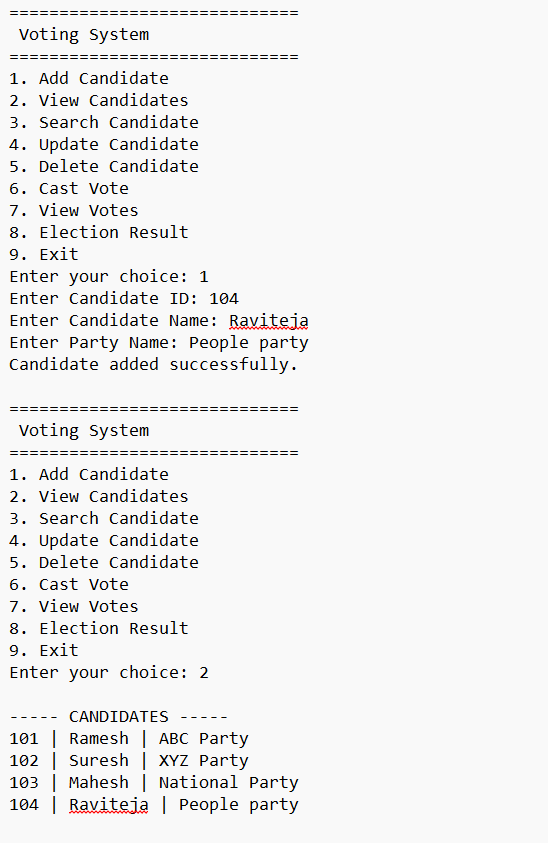
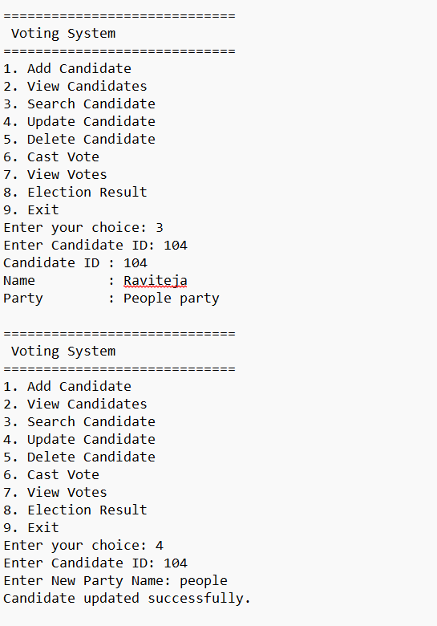
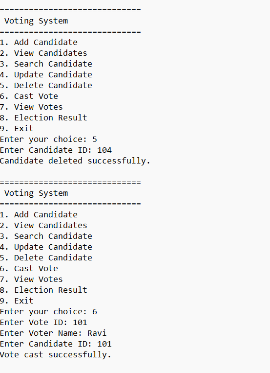
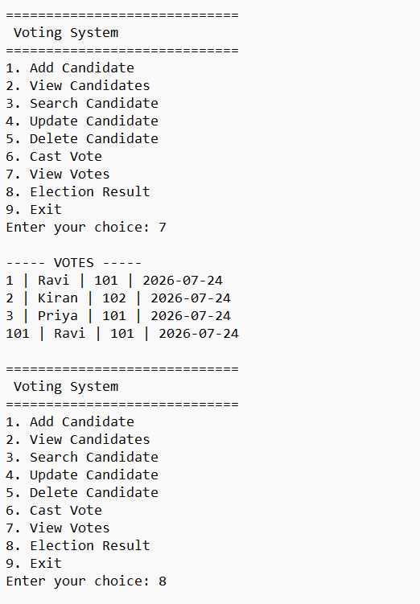
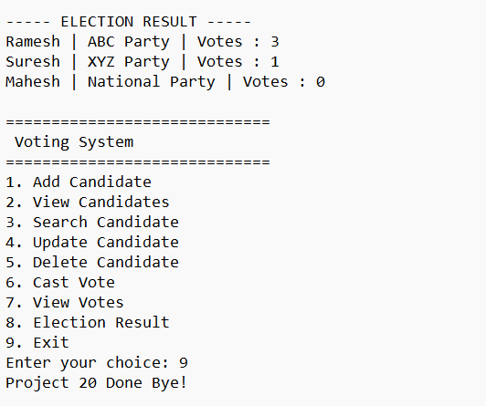

# 🗳️ Project 20 | Voting System | Java + Oracle 11g |

> **Day 20 of 102 Java Projects Challenge | Tier 2 - JDBC + Oracle**


A complete **console-based Voting System** developed using **Core Java, JDBC, Oracle Database 11g XE, Maven, and DAO Pattern**. This project demonstrates real-world database operations including candidate management, vote casting, election result generation using SQL JOIN and complete CRUD functionality.

---

# 📸 Application Demo











---

# 🚀 Features

| Feature | Description |
|----------|-------------|
| ✅ Add Candidate | Register a new election candidate |
| ✅ View Candidates | Display all registered candidates |
| ✅ Search Candidate | Search candidate using Candidate ID |
| ✅ Update Candidate | Update candidate party name |
| ✅ Delete Candidate | Remove candidate from database |
| ✅ Cast Vote | Record a vote for a candidate |
| ✅ View Votes | Display all voting records |
| ✅ Election Result | Display total votes for each candidate using SQL JOIN |

---

# 🛠 Technology Stack

- **Language:** Java 21
- **Database:** Oracle Database 11g XE
- **Connectivity:** JDBC
- **Build Tool:** Apache Maven
- **Architecture:** DAO Pattern
- **IDE:** Eclipse IDE
- **Version Control:** Git & GitHub

---

# 📂 Project Structure

```text
20-voting-system-cli
│
├── screenshots
│   ├── demo1.png
│   ├── demo2.png
│   ├── demo3.png
│   ├── demo4.png
│   └── demo5.png
│
├── src
│   └── main
│       └── java
│           └── com
│               └── raviteja
│                   └── voting
│                       ├── dao
│                       │     VotingDAO.java
│                       ├── main
│                       │     VotingManagementSystem.java
│                       ├── model
│                       │     Candidate.java
│                       │     Vote.java
│                       ├── service
│                       │     VotingService.java
│                       └── util
│                             DBConnection.java
│
├── schema.sql
├── pom.xml
├── .gitignore
└── README.md
```

---

# 🗄 Database Tables

## CANDIDATES

| Column | Type |
|----------|------|
| CANDIDATE_ID | NUMBER |
| CANDIDATE_NAME | VARCHAR2(100) |
| PARTY_NAME | VARCHAR2(100) |

---

## VOTES

| Column | Type |
|----------|------|
| VOTE_ID | NUMBER |
| VOTER_NAME | VARCHAR2(100) |
| CANDIDATE_ID | NUMBER |
| VOTE_DATE | DATE |

**Relationship**

- `CANDIDATE_ID` in **VOTES** is a **Foreign Key** referencing `CANDIDATES(CANDIDATE_ID)`.

---

# 💻 SQL Operations Used

- CREATE USER
- GRANT
- CREATE TABLE
- INSERT
- SELECT
- UPDATE
- DELETE
- LEFT JOIN
- COUNT
- PRIMARY KEY
- FOREIGN KEY
- COMMIT

---

# 📖 Concepts Covered

- Core Java
- Object-Oriented Programming (OOP)
- JDBC API
- Oracle Database Connectivity
- PreparedStatement
- ResultSet
- Exception Handling
- DAO Design Pattern
- Service Layer Architecture
- SQL JOIN
- Aggregate Functions

---

# 💻 Console Menu

```text
=============================
 Voting System
=============================
1. Add Candidate
2. View Candidates
3. Search Candidate
4. Update Candidate
5. Delete Candidate
6. Cast Vote
7. View Votes
8. Election Result
9. Exit
```

---

# ▶️ How to Run

### 1. Clone the repository

```bash
git clone https://github.com/YOUR_USERNAME/20-voting-system-cli.git
```

### 2. Open the project in Eclipse.

### 3. Configure the Oracle JDBC Driver.

### 4. Update the database credentials in `DBConnection.java`.

### 5. Execute `schema.sql`.

### 6. Run:

```text
VotingManagementSystem.java
```

### 7. Test all menu options.

---

# 📚 Learning Outcomes

- Built a real-world JDBC application
- Implemented complete CRUD operations
- Connected Java with Oracle 11g XE
- Practiced SQL JOIN queries
- Generated election results using SQL aggregate functions
- Applied DAO Pattern
- Implemented Service Layer Architecture
- Managed relational data using Foreign Keys
- Strengthened Maven project organization

---

# 👨‍💻 Author

**Raviteja**

Java Full Stack Developer


---

## ⭐ Support

If you found this project helpful, don't forget to **Star ⭐ this repository** and follow my **102 Java Projects Challenge** journey on GitHub.
